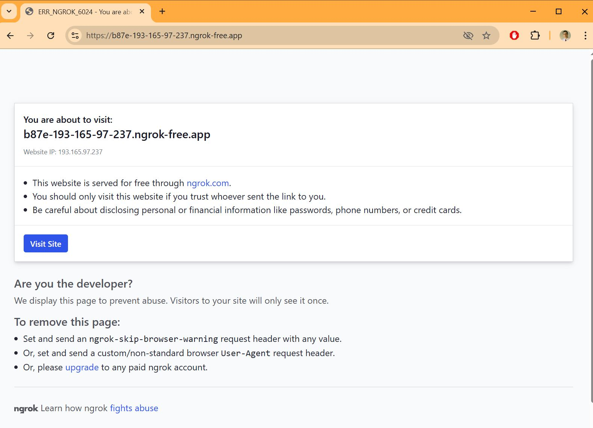

# Raspberry-WEBCamera
Raspberry based WEB camera with Flask 

## Hardware:
 - Raspberry PI zerro 2W
 - Rapberry Camera 5Mpixels
 - Keyboard with micro USB adapter (only for initial setup)
 - Monitor with micro HDMI adapter (only for initial setup)
 - other PC in the same local network

## System setup
1. GUI is not needed and I plan to use CLI via ssh, so instal [Raspberry Pi OS Lite](https://www.raspberrypi.com/software/operating-systems/)

2. Attach monitor and mouse and perform initial configuration: user, timezone, WiFi connection. 
`sudo raspi-config` is great tool for this.

3. enable ssh in raspi-config or from CLI:
```
sudo systemctl enable ssh
sudo systemctl start ssh
```
4. Determine IP arrdess: `hostname -I`
5. On the other computer in the same local network use any shell and login via ssh : `ssh <user>@<ip address>`

After succcessfull login via ssh we do not need monitor and keyboard connected to Raspberry Pi any more.

## Setup of remote connection from internet via ngrok
1. Create [ngrok free account](https://dashboard.ngrok.com/signup), copy [authentication tocken](https://dashboard.ngrok.com/api-keys).
2. Install ngrok agent on Raspberry PI:
```
wget https://bin.equinox.io/c/bNyj1mQVY4c/ngrok-stable-linux-arm64.tgz
tar -xvzf ngrok-stable-linux-arm64.tgz
sudo mv ngrok /usr/local/bin/
```
3. Authenticate:
```
ngrok config add-authtoken <ngrok-auth-token>
```
4. To check how it is works start tunnel mannualy:
```
ngrok tcp 22
```
there should be otput like `Forwarding <ngrok URL>:<port> -> localhost:22` <br>
Now it is possible to login from anywhere from internet vith
```
ssh <user name>@<ngrok URL> -p <port>
```
 

## Auto start remote connection
1. Create a systemd service file */etc/systemd/system/ngrok-all.service*
change *username* to your user:
```
[Unit]
Description=ngrok for ssh
After=network.target

[Service]
User=username
ExecStart=/usr/local/bin/ngrok start --all
ExecStartPost=/home/username/ngrok-log.sh
Restart=on-failure

[Install]
WantedBy=multi-user.target
```
2. Enable the service
```
sudo systemctl daemon-reexec
sudo systemctl daemon-reload
sudo systemctl enable ngrok-all.service
sudo systemctl start ngrok-all.service
```
3. Public SSH address can be seen by:
```
journalctl -u ngrok-all.service -n 50
```
it is should be like
```
Forwarding tcp://0.tcp.ngrok.io:14782 -> localhost:22
```

## Extract SSH address to file
Every new start ngrok uses new address and port, but we need to know them to connect

1. Abow in journalctl we saw how the address looks like. Let's write script to extract address and save it to file. Create script in */home/username/ngrok-log.sh* (change *username* to your user)
```
#!/bin/bash

# Wait and try up to 10 times to get ngrok TCP address
for i in {1..10}; do
    ADDRESS=$(curl -s http://127.0.0.1:4040/api/tunnels | grep -oE 'tcp://[^\"]+')
    if [[ -n "$ADDRESS" ]]; then
        echo "NGROK SSH: $ADDRESS" > /home/username/ngrok-ssh.txt
        exit 0
    fi
    sleep 2
done

echo "NGROK SSH: not available" > /home/username/ngrok-ssh.txt
exit 1
```
permition to execute:
```
chmod +x /home/username/ngrok-log.sh
```
2. Create system service file to run the script */etc/systemd/system/ngrok-log.service*
```
[Unit]
Description=Save ngrok public SSH address to file
After=ngrok-ssh.service

[Service]
ExecStart=/home/username/ngrok-log.sh
User=username
Environment=HOME=/home/username
WorkingDirectory=/home/username

[Install]
WantedBy=multi-user.target
```

3.Enable and start it
```
sudo systemctl daemon-reload
sudo systemctl enable ngrok-log.service
sudo systemctl start ngrok-log.service
```
4. Do reboot and check tha t address have been saved to file"
```
cat ~/ngrok-ssh.txt
```

## Send SSH address to telegram bot
1. Create a Telegram Bot: 
in Telegram search for @BotFather, write to the chat `/newbot`, create bot by following the prompt, receive and save telegram bot token. it looks like "123456789:ABCdefGhIJKlmNoPQrstuvWxyZ"
2. In Telegram find and open chat with hew bot, send something, for example "Hi!"
3. Check bot API. From Raspberry Pi send (put correct token there)
```
curl -s "https://api.telegram.org/bot<Telegram_bot_token>/getUpdates"

```
it should return JSON like:
```
"chat":{"id":123456789,"first_name":"YourName",...}
```
copy and save id (it is chat ID).

4. update script in ~/ngrok-log.sh
```
#!/bin/bash

BOT_TOKEN="your_actual_bot_token"
CHAT_ID="your_actual_chat_id"

for i in {1..10}; do
    ADDRESS=$(curl -s http://127.0.0.1:4040/api/tunnels | grep -oE 'tcp://[^"]+')
    if [[ -n "$ADDRESS" ]]; then
        echo "NGROK SSH: $ADDRESS" > /home/username/ngrok-ssh.txt

        # Send Telegram message with proper formatting and URL encoding
        curl -s -X POST "https://api.telegram.org/bot${BOT_TOKEN}/sendMessage" \
         --data-urlencode "chat_id=${CHAT_ID}" \
         --data-urlencode "parse_mode=Markdown" \
         --data-urlencode text=$'📡 *Your Raspberry Pi is online!*\nSSH available at:\n`'"${ADDRESS}"'`'

        exit 0
    fi
    sleep 2
done

echo "NGROK SSH: not available" > /home/username/ngrok-ssh.txt
exit 1
```
be sure it is executable `chmod +x ~/ngrok-log.sh`

5. Reboot. You will receive ssh address in telegram bot.

## WEB Camera

1. Prerequisites
next packages should be installed on system level with sudo apt install to support basic operation
(just WEB camera without object detection - file camera_server.py):
* python3-flask,
* python3.11-dev,
* libcamera-dev,
* libcamera-apps,
* python3-libcamera,
* python3-picamera2,
* libjpeg-dev,
* libjpeg62-turbo-dev,
* python3-opencv

2. Add a new tunnel to ~/.config/ngrok/ngrok.yml for camera:
```
version: "2"
authtoken: 2zB3cCsYQfHqJmkZEbr2cegRi0q_7YnR6wssLLzPcaC8dH2Q6

tunnels:
  ssh:
    proto: tcp
    addr: 22
  camera:
    proto: http
    addr: 5000
```
Thr changes will be applied afrer reboot or on manual restart of service:
```
sudo systemctl restart ngrok-all.service
```
3. Update ngrok-log.sh, so it will extract and send to telegram both, ssh and camera addresses:
```
#!/bin/bash

BOT_TOKEN="<pu telegram bot tocken here>"
CHAT_ID="<put telegram chat ID here>"

# Wait for ngrok to become ready
for i in {1..10}; do
    RESPONSE=$(curl -s http://localhost:4040/api/tunnels)
    SSH_URL=$(echo "$RESPONSE" | grep -o 'tcp://[^"]*')
    CAM_URL=$(echo "$RESPONSE" | grep -o 'https://[^"]*')


    if [[ -n "$SSH_URL" && -n "$CAM_URL" ]]; then
        echo "NGROK SSH: $SSH_URL" > ~/ngrok-ssh.txt
        echo "NGROK HTTPS: $CAM_URL" > ~/ngrok-cam.txt

        # Parse host and port from SSH_URL (e.g., tcp://6.tcp.eu.ngrok.io:19595)
        HOST=$(echo "$SSH_URL" | cut -d/ -f3 | cut -d: -f1)
        PORT=$(echo "$SSH_URL" | cut -d: -f3)

        # Escape for MarkdownV2
        SSH_LINE="ssh dima@${HOST} -p ${PORT}"
        ESCAPED_SSH_LINE=$(echo "$SSH_LINE" | sed -E 's/([][_*()~`>#+=|{}.!\\-])/\\\1/g')

        MESSAGE="📡 *Your Raspberry Pi is online\.
SSH access:*  \`${ESCAPED_SSH_LINE}\`
*WEB camera:* \`${CAM_URL}\`"

        echo "$(date) ngrok-log.sh MSG_sent" >> ~/ngrok-debug.log

        RESPONSE=$(curl -s -X POST "https://api.telegram.org/bot${BOT_TOKEN}/sendMessage" \
          --data-urlencode "chat_id=${CHAT_ID}" \
          --data-urlencode "parse_mode=MarkdownV2" \
          --data-urlencode "text=${MESSAGE}")

        echo "$RESPONSE" >> ~/ngrok-telegram.log
        exit 0
    fi
    sleep 2
done

echo "Failed to retrieve ngrok tunnels" > ~/ngrok-fail.log
```
 Now on reboot Raspberry starts ngrok-all.service, so tunnels will be created, then runs ngrok-log.service which extracts tunneled addresses and sends addresses to telegram bot:

 

4. use addresses from the message to access ssh:


5. and start camera_server.py with flask:

```
python camera_server.py
```


now you can see camera striming not only in local network on http://192.168.100.21:5000 but also to internet by address in telegram message via ngrok service:



